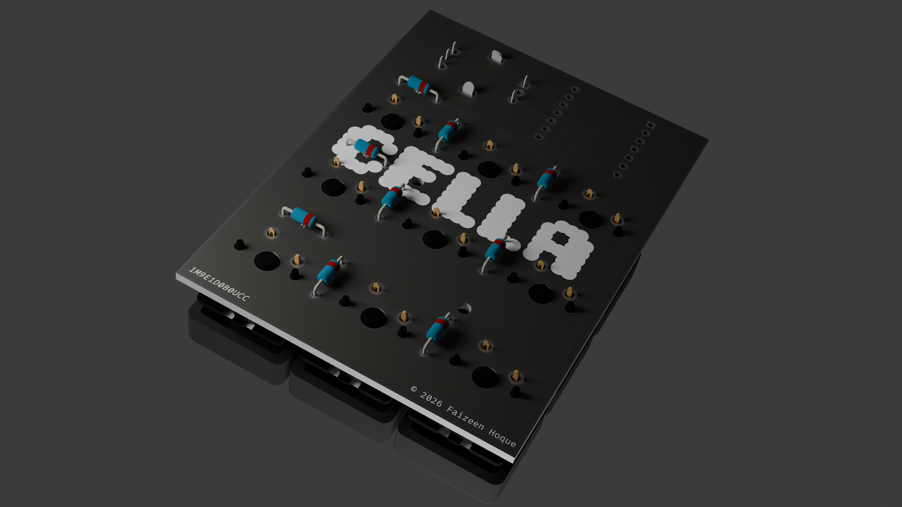

# CELLA 1M9E1D0B0UCX

> A minimal 9-key macropad with rotary encoder. Custom PCB, XIAO RP2040, KMK firmware.

---

## Specs

| | |
|---|---|
| MCU | Seeed XIAO RP2040 |
| Switches | 9× MX-compatible (3×3 matrix) |
| Encoder | 1× rotary with push switch |
| Display | None |
| Bluetooth | No |
| Connector | USB-C |
| Firmware | KMK on CircuitPython |
| PCB | Custom, KiCad |

---

## Naming Convention

`CELLA [V][T][K]E[E#]D[D#]B[B#][CON][CASE]`

| Code | Meaning | Values |
|------|---------|--------|
| `V` | Version | `1`, `2`, `3`... |
| `T` | Type | `M` Macro · `N` Numpad · `D` Dial |
| `K` | Key count | `9`, `12`, `16`... |
| `E#` | Encoder | `E1` yes · `E0` no |
| `D#` | Display | `D1` yes · `D0` no |
| `B#` | Bluetooth | `B1` yes · `B0` no |
| `CON` | Connector | `UC` USB-C · `UM` Micro-B |
| `CASE` | Case | `C` clear · `B` black · `W` white · `X` no case |

**Example:** `CELLA 1M9E1D0B0UCX` — Version 1, Macro, 9 keys, 1 encoder, no display, no bluetooth, USB-C, no case.

---

## Renders

---

## License

© 2025 Faizeen Hoque